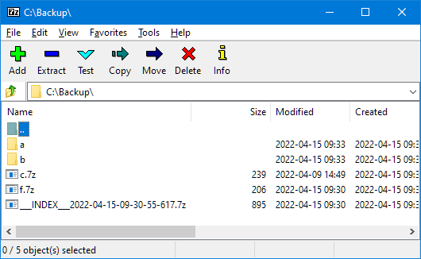
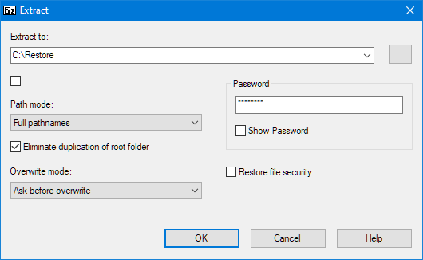

# 7-sync

A wrapper for [7-Zip](https://www.7-zip.org/) to create cloud-friendly encrypted backups.

# How it works

7-sync creates an exact mirror of a source directory and stores it in a destination directory. Files are compressed and encrypted with [7-Zip](https://www.7-zip.org/) and their names are enumerated:

```
C:\Users\David\Documents  ==>  C:\Users\David\Backup
+-- Employment                 +-- a
|   +-- work-contract.pdf      |   +-- a.7z
|   +-- timesheet.xlsx         |   +-- b.7z
+-- Notes                      +-- b
    +-- tasks.docx             |   +-- a.7z
                               +-- ___INDEX___2022-04-10-07-25-47-394.7z
```

An encrypted `___INDEX__` archive is added to the destination directory. It contains a text file that shows the mapping of files and directories:

```
Employment => a
Employment\work-contract.pdf => a\a.7z
Employment\timesheet.xlsx => a\b.7z
Notes => b
Notes\tasks.docx => b\a.7z
```

The `___INDEX___` file also contains 7-sync's internal database. It holds additional metadata about the source files and allows 7-sync to detect changes. When a file has been modified, the respective destination file is deleted and a new one (with a different name) is created instead:

```
C:\Users\David\Documents           C:\Users\David\Backup
+-- Notes                          +-- b
    +-- tasks.docx  <= modified        +-- a.7z  <= deleted (old version)
                                       +-- b.7z  <= created (new version)
```

When synchronizing a 7-sync-encrypted backup to cloud storage, there's no need to compare timestamps to identify modified files. 7-sync never modifies any file in the destination. When a file has changed, it's deleted and re-created under a different name. Filenames (within each directory) are unique and never re-used.

Backups are restored using the [7-Zip](https://www.7-zip.org/) GUI only. The index file (showing the mapping of filenames) makes it easy to locate and selectively restore individual files and directories.

# Benefits

Compared to other synchronization tools with filename encryption, 7-sync has the following advantages:

- Filenames are enumerated (`a.7z`, `b.7z`, ...). This provides the same level of privacy as encrypted filenames, but the names are much shorter and only contain letters and digits.
  - Some tools that encrypt filenames use non-alphanumerical characters (e.g. `2U%7cie;'w@aVU;Iu'U8&B^s~`). This can cause problems with some cloud storage providers who restrict the symbols that can be used in filenames.
  - Some tools encode encrypted filenames as base64 (e.g. `MlUlN2NpZTsnd0BhVlU7SXUnVTgmQl5zfgo=`). This avoids the beforementioned problem but makes the names much longer. Deeply nested subdirectories can exceed the target file system's maximum path length.
- Some cloud storage providers do not properly report files' modified timestamps. This can cause issues with change detection and lead to unnecessary re-uploads. 7-sync never updates any files. Instead, it deletes the old file and creates a new one with a different name. There's no need to check timestamps when synchronizing a 7-sync-encrypted backup to cloud storage.
- Backups are restored using [7-Zip](https://www.7-zip.org/) only. 7-sync does not even provide any restore features. Each file can be downloaded and restored individually as needed.

# Limitations

7-sync has the following limitations:

- It only operates on the local file system and creates exact copies (mirrors). A complete end-to-end backup procedure requires additional features like filtering out irrelevant files and uploading the backup to cloud storage. 7-sync is meant to be used as one tool in a chain. For example:
  - Create an unencrypted backup with [rsync](https://rsync.samba.org/), filtering out unneeded files and expanding/inlining symbolic links.
  - Create an encrypted backup with 7-sync.
  - Use tools like [FreeFileSync](https://freefilesync.org/) or [WinSCP](https://winscp.net/eng/index.php) to upload the encrypted backup to cloud storage.
- Creating backups can be comparatively slow. 7-sync runs a separate [7-Zip](https://www.7-zip.org/) command for every file that needs to be transferred. This is much slower than just copying files.
- 7-sync stores its internal database in an `___INDEX__` archive in the destination directory. If this file gets damaged or is lost, the synchronization can't be resumed. Instead, all files would need to be deleted from the destination (and any cloud storage) and everything would need to be synchronized/re-encrypted from scratch.
- Symbolic links are not supported and are ignored during the synchronization.
- The password is used directly to encrypt the files. Changing the password causes all files to be re-encrypted during the next synchronization run. That is, all files are deleted and new ones (with a different name) are created.

# Installation and setup

As prerequisites, 7-sync requires Node.JS and 7-Zip to be installed first:

- Download and install [Node.js](https://nodejs.org/en/download/)
- Download and install [7-Zip](https://www.7-zip.org/)

7-sync itself is a Node.JS package and can be installed via `npm`:

```sh
npm install -g 7-sync
```

7-sync uses configuration files to store things like the source and destination directories. A new configuration file can be initialized via:

```sh
7-sync init
```

This will start a wizard and prompt for the required information. The configuration can be changed later on with:

```sh
7-sync reconfigure
```

Despite the setup wizard prompting for the password, it's not stored in the configuration file. 7-sync only keeps a salted hash (similar to a checksum). It can't be used to extract or reconstruct the password itself. The hash is only used to ensure that the same password is provided each time a synchronization runs.

# Creating backups

The synchronization can be started via:

```sh
7-sync sync
```

A dry run can be used to see what the synchronization would do, without it creating or deleting any files:

```sh
7-sync sync --dry-run
```

If the configuration file has a different name or does not reside in the current directory, it needs to be specified explicitly:

```sh
7-sync sync --config=my-settings/7-sync-my-documents.cfg
```

Each time the synchronization runs, it prompts for the password. It is strongly recommended to always enter it manually. This helps to keep the memory fresh and be able to restore the backup in the hour of need. Although discouraged, the password can also be passed as a command-line option:

```sh
7-sync sync --password=my-password
```

Similarly, it can also be set as an environment variable named `SEVEN_SYNC_PASSWORD`.

# Restoring backups

If the backup is stored in the cloud, download it first. To only restore selected files and directories, download the index file (e.g. `___INDEX___2022-04-10-07-25-47-394.7z`) from the root directory. Open it in [7-Zip](https://www.7-zip.org/) and extract `7-sync-file-index.txt`. Look up the respective files and directories and download them as required.

Store all files and directories that need to be restored in one directory and open this directory in [7-Zip](https://www.7-zip.org/):



In the menu, enable `View` => `Flat View`:


This will show all files from all subdirectories in one flat list. Then select all the files (but no directories). This can be done by clicking on the first file in the list, then scrolling to the bottom, pressing the `Shift` key, and clicking on the last file in the list:


Now click on the `Extract` button in the toolbar and configure how and where to extract the files:



Make sure to populate the dialogue as follows:

- The `Extract to` path must **not** contain `*` (like for example `C:\Restore\*\`). The checkbox below must **not** be ticked either. Otherwise, 7-Zip creates a separate subdirectory for each file.
- Set the `Path mode` to `Full pathnames` and tick `Eliminate duplication of root folder`.

Then enter the password and click `OK`. If the password is correct, 7-Zip will unpack all the files

# Errors and warnings

At the end of a synchronization, 7-sync might display errors and warnings. More details might be available in the log file. It's created in parallel to the configuration file (default: `7-sync.log`) and contains information about the last 10 synchronizations and dry runs. Search for `ERROR` and `WARNING` to locate error messages.

**Files could not be copied**

The backup is incomplete because some files could not be copied. This might be caused by files being opened (and locked) by other applications. It might also be down to insufficient file access permissions. Files that could not be copied will be retried in subsequent synchronization runs.

If the issue persists, check the log file to identify the affected files. Depending on the cause, adjust the files' access permissions and/or close applications that lock them. Then synchronize again.

**Files could not be deleted**

Some outdated files could not be removed from the backup.  This might be caused by files being opened (and locked) by other applications. It might also be down to insufficient file access permissions. Files that could not be deleted will be retried in subsequent synchronization runs.

If the issue persists, check the log file to identify the affected files. Depending on the cause, adjust the files' access permissions and/or close applications that lock them. Then synchronize again.

**The previous synchronization left orphans behind**

There were unknown files in the destination that were not registered in the database. This happens when a synchronization is aborted halfway through. When orphans are found, they are deleted from the destination. They usually do not cause any problems.

Background: 7-sync keeps a database that lists all files in the destination directory. Running a synchronization causes outdated files to be deleted and new ones to be created. Each operation updates the database. However, the database is saved only once per minute (as well as at the end of the synchronization). If the process is aborted after creating files, but before saving the database, the database is out of sync. The next synchronization would resolve this inconsistency by deleting recently created files and re-creating them under a different name.

**Files have been removed from the database**

The database contained files and/or directories that exist neither in the source nor the destination. This can be caused by an aborted synchronization. If so, the warning can be ignored. 7-sync automatically resolves this inconsistency by purging orphans from the database.

If the error occurred without the previous synchronization being aborted, another application might have removed files from the destination directory. This should be avoided. Only 7-sync should create and delete files in the destination directory.

**Failed to update the database**

At the end of the synchronization, the database could not be saved. This causes all recently copied files to become orphans. The next synchronization would report them. It would also delete and re-create them with different filenames. It is recommended to re-run the synchronization. Please check the log file for a more detailed error message if the problem persists.

**The source contains symbolic links or otherwise unprocessable objects**

7-sync does not support symbolic links (and other file system items like block devices). They are ignored and not transferred to the destination directory. This is not a problem, but it leaves the destination as an incomplete copy of the source. It is recommended to use 7-sync as one tool in a chain. For example, create an unencrypted backup with [rsync](https://rsync.samba.org/) first, filtering out unneeded files and expanding/inlining symbolic links. Then use 7-sync to create an encrypted mirror in a separate directory.
